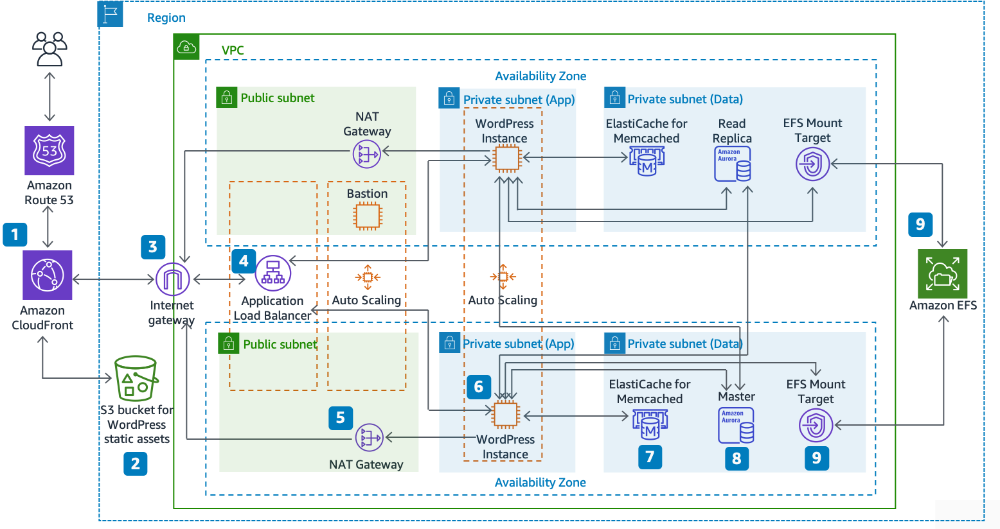

# AWS WordPress Highly Available Demo Architecture

* [Overview](#overview)
* [Architecture](#architecture)
* [Prerequisites](#prerequisites)
  * [AWS account](#aws-account)
  * [AWS CLI](#aws-cli)
  * [Node.js](#nodejs)
* [Instructions](#instructions)
  * [Setting up AWS local profile and credentials](#setting-up-aws-local-profile-and-credentials)
  * [Clone this repository to your local machine](#clone-this-repository-to-your-local-machine)
  * [Bootstrap the CDK environment on AWS account](#bootstrap-the-cdk-environment-on-aws-account)
  * [Synthesizing the CloudFormation template](#synthesizing-the-cloudformation-template)
  * [Deploying the application](#deploying-the-application)
  * [Cleaning up](#cleaning-up)
* [Out of scope](#out-of-scope)

## Overview
Demo CDK app that deploys a HA WordPress architecture on AWS.

## Architecture


## Prerequisites

* [AWS account](https://docs.aws.amazon.com/cdk/v2/guide/getting_started.html).

* [AWS CLI](https://docs.aws.amazon.com/cli/latest/userguide/getting-started-install.html).

* [Node.js](https://nodejs.org/en/download/) ~v20.14 ([nvm](https://github.com/nvm-sh/nvm?tab=readme-ov-file#installing-and-updating))


## Instructions

### Setting up AWS local profile and credentials
Create a new profile in your AWS CLI configuration file:
```bash
aws sso login --profile WordPressSandbox
# or
aws configure sso --profile WordPressSandbox

# Get the AWS account ID and the region
aws sts get-caller-identity --profile WordPressSandbox

# Set local environment variables
export AWS_PROFILE=WordPressSandbox
export AWS_ACCOUNT_ID=<AWS_ACCOUNT_ID>
export AWS_REGION=<AWS_REGION>

export CDK_DEFAULT_ACCOUNT=$AWS_ACCOUNT_ID
export CDK_DEFAULT_REGION=$AWS_REGION
```

### Clone this repository to your local machine

Clone this repository on local machine:
```bash
git clone https://github.com/Grigore147/aws-wordpress-demo.git
``` 
Install the required dependencies:
```bash
cd aws-wordpress-demo/infrastructure/aws/cdk
npm ci
```

### Bootstrap the CDK environment on AWS account
```bash
npx cdk bootstrap
```

### Synthesizing the CloudFormation template
```bash
npx cdk synth
```

### Deploying the application
```bash
npx cdk deploy
```

### Cleaning up
```bash
npx cdk destroy
```


## Out of scope
This demo doesn't cover all the best practices for deploying a WordPress architecture on AWS.

Here are some improvements that could be made:
* DNS hosted zone
* Static content serving from S3 and CloudFront
* Caching with ElastiCache
* Enhanced monitoring and logging
* Enhanced security with WAF, Shield and other security services
* CI/CD pipeline
* Automated backups and DR setup
